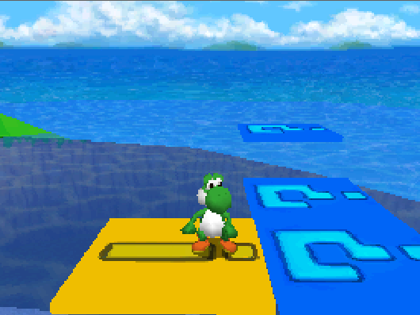

# More Objects Mod
Toolkit and resources for SM64DS for some custom objects.

## Installation

Inside this repository is a `commands.sm64ds` file which can be used with SM64DSe-Ultimate to insert, compile assets and dynamics libraries.

## Using Dynamics libaries

You need to download this repository to your computer. And have installed the latest version of [SM64DSe-Ultimate](https://github.com/Gota7/SM64DSe-Ultimate).

Inside the editor go to `More -> Import Patch` and select the `refactorTest.sp2` file from this repository.
Repeat the process once it finishes with `CompileTest.sp2`.

> ⚠️ The file `Code/include/List/FileList.h` and `Code/include/List/SoundList.h` are **generated** by the Editor when using the CompileTest.sp2 script.

> 🚨 The `SM64DSe/objectdb.xml` is **not** updated therefore **cannot** be used.

## Custom Objects

- 🚧: WIP
- ✅: Implemented as Dynamic Library
- ❓: Unknown status
- 🚩: Compile but crash at runtime

| Name                                                     | Screenshot | Status |
|----------------------------------------------------------|------------|--------|
| Galaxy Shrinking Platform                                |            | ✅ |
| CosmicClones                                             |            | ✅ |
| Rideable Yoshis                                          |            | ✅ |
| Berries                                                  |            | ✅ |
| Invisible Walls                                          |            | ✅ |
| Silver Coins (Code/source/O_ColoredCoin)                 |            | ✅ |
| Object Lighting Modifier                                 |            | ✅ |
| Toxic Levels                                             |            | ✅ |
| 6 Types of Colored Goombas                               |            | 🚧 |
| Noteblocks                                               |            | ✅ |
| Shy Guys                                                 |            | ✅ |
| Magikoopa & Kamella                                      |            | ✅ |
| Launch Stars & Star Chips                                |            | ✅ |
| Skybox Rotator                                           |            | ✅ |
| Gravity Modifier                                         |            | ❓ |
| Yoshi NPC's                                              |            | ✅ |
| Colored Warp Pipes                                       |            | ✅ |
| Character Blocks                                         |            | ✅ |
| Tree Shadows                                             |            | ✅ |
| Save Blocks                                              |            | ✅ |
| Door Blockers                                            |            | ✅ |
| Colored Coins                                            |            | ✅ |
| Colored Toads                                            |            | ❓ |
| Peach NPC                                                |            | ✅ |
| Blue Ice Block                                           |            | ❓ |
| Mega Block                                               |            | ✅ |
| Cutscene Loader                                          |            | 🚧 |
| Custom Block                                             |            | 🚧 |
| Treasure Chest                                           |            | 🚩 |
| Thwomp & Magma Thwomp                                    |            | 🚧 |
| 2D Level (With Camera Limiter)                           |            | ❓ |
| FlipSwitch  |  | ✅ |

### Not working objects

| name | description                                                                                                                   |
| --- |-------------------------------------------------------------------------------------------------------------------------------|
| Treasure Chest (Code/source/O_TreasureChest) | Not working THUMB9: Undefined instruction: 0x0000BBF8 PC=0xE40000D4 ARM9: Undefined instruction: 0x0000BBF8 PC=0xE40000D4 |

## Credits
Gota7 - Mod, custom objects, sound and resource management.

Josh - Custom objects.

Splatterboy - Custom objects. Porting to Dyanmics libraries

Starpants - Misc. ASM, General help.

Overblade - RE help.

0reo - Idea.
